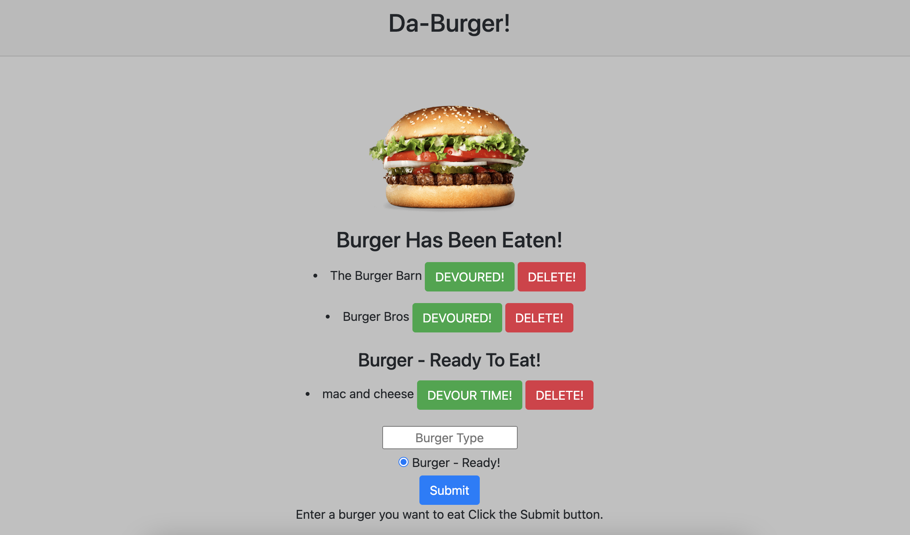

# Da Burger

## Table of Contents

- [Description](#description)

- [Technologies Used](#technologies-used)

- [Installation](#installation)

- [Preview](#preview)

- [Questions](#questions)

## Description

```
This application will keep track of all your burgers and their status(eaten and prepared, ready to eat).
```

## Technologies Used

**Language:** Node.js, HTML, CSS

**Dependencies:** MySQL, Express

**Version Control:** GitHub

**Cloud Platform:** Heroku

## Installation

To install necessary dependencies, run the following command:

```
npm i
```

OR

```
npm install
```

## Preview

---

## 

## Questions

If you have any questions about the repo, open issue or contact me directly at [anjalikevadiya5@gmail.com](anjalikevadiya5@gmail.com). You can find more of my work at [AnjaliKevadiya](https://github.com/AnjaliKevadiya).
